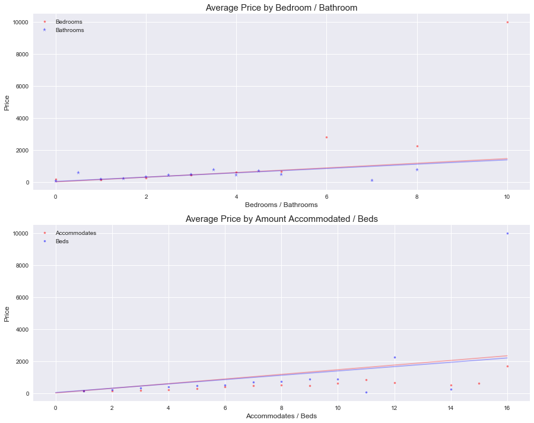

# Exploratory Data Analysis

[Jupyter Notebook](http://nbviewer.jupyter.org/github/nolanadams1230/Data-Science-Portfolio/blob/master/Springboard%20Data%20Science%20Course/Capstone%201%20-%20AirBnB/Exploratory%20Data%20Analysis.ipynb)

[Github](https://github.com/nolanadams1230/Data-Science-Portfolio/blob/master/Springboard%20Data%20Science%20Course/Capstone%201%20-%20AirBnB/Exploratory%20Data%20Analysis.ipynb)

# Overview

The main objective of this exploratory data analysis is to provide a better understanding of the features and their relationship's with the two variables we are trying to predict: **Price** & **Rating**.

# Analysis

## Numerical Features

We first consructed boxplots for all the numerical features, so that we can examine the outliers and skewness of each variable. Some things we notice:
 
* All values are skewed, and most of them are skewed heavily right. This tell us that the majority of the listings in San Francisco are are smaller listings, with some extreme unusual cases (such as 10 bedrooms). 
  * Minimum nights and maximum nights have some extreme points, that appear to be errors or the host choosen an arbitrary high number. (Maximum nights is over 2 billion). We removed these as the will only be harmful to our prediction model.
  * Price is also heavily skewed to the right, and since it is one of our response variables we will examine this more closely later.
* The features that are skewed left are the review scores. Most of them have an extremely small IQR as well. This is a common occurance in ratings, where most people give a perfect score unless there was some unusual negative event that occured. 
  * Review scores for *cleanliness*, *value*, and *location* have the largest IQR range, which may indicate that people put more thought into these reviews and they may be stronger predictors.
 
 We then seperate the discrete numerical values and the continuous numerical values. For the *Discrete* numerical values we created countplots to see how the values were distributed.
 
 * Its clear that the columns beds, bathrooms, accommodates, and bedrooms have very extreme values. 99% of listings fall within half of the max beds, bathrooms, and bedrooms.  
 
 For the *Continuous* variables we constucted histograms to examine their distribution. We really just see how strongly everything is skewed. We should consider dropping more outliers, since they are so extreme.
 
 Next we created a correlation heatmap of all the variables.
 
 * We can see that Accommodates, Beds, Bathrooms, Cleaning Fee, and Guest included are all highly correlated with each other. May be useful to drop a few of these to improve our model's prediction.
 * The review scores are all highly correlated with each other as well. We should consider dropping a few of these too. I think there is reason to keep them in aswell. These may bring insights into what is the most important review a host can focus on to improve their overall rating.
 * Days since first review and number of reviews are correlated, which makes since that the longer a host has been renting our the more reviews they would have. I assume that days since host isn't correlated becuase there are a lot of inactive listings from host that started and stopped airbnb a long time ago. This could be becuase they chose not to comply with San Francisco's Airbnb regulations.
 
 ## Categorical Features
 
We created barcharts for all 110 amenities. Only 56 of the 110 amenities applied to even 5% of the listings. These should be considered outliers it may be useful to drop these.
 

We then may a similar plot with all the True / False categories in our data. Has_square_feet, host_has_profile_pic, require_guest_profile_picture, and require_guest_phone_verification are very skewed and have a heavy majority of listigns either True or False.

We then explore the Multi-Level Categorical features with countplots. It was clear the majority of listings were a house, apartments, or condominium with a real bed. The neighborhoods and zipcodes were very well dispersed.

## Price
From there we explore **Price**. We contructed a distribution plot that showed us the center of the distribution falls at $153 and the mean is at $210 with a right skew with a long tail. Some values seem to be outliers and should be removed from the dataset, so that they don't negatively affect the prediction models.

Further exploring Price, we built a boxplot that showed just how strongly right skewed the distribution of price for listings in San Francisco with these boxplots. The Interquartile range is between $105 and $250, yet the prices extend to around $10,000. The IQR rule for outliers shows us that there are 347 outliers in this dataset.  

Intuitively, one would assume that bedrooms, bathrooms, beds, and accommodates would have a significant relationship with the price of a listings. We built a line plot that showed us that bedrooms and beds column have extreme values that greatly influcne the regression line. We will removed the listings with 14 or more accommodates, so that our prediction model is more accurate. 

Building a countplot of each of these 4 columns has brought to our attention some interesting occurances. All of them are right skewed with the majority in 2/3 levels. Also there are 15 units with 7 or more bathrooms yet only 2 listings with 7 or more bedrooms. Upon futher investigation the listings that are Hostels count all their communial bathrooms into their listing, while only counting 0 or 1 beds per listing. These 15 listings may be affecting the correlation of bathrooms with the other ones we have been investigating.

Seeing that listings that are "Hostels" has interesting characteristics, we continued to explore Countplot and BarChart of median price of Property Type, Room Type, and Bed Type.

<b> Property Type: </b> Of the 25 different property types in San Francisco over 90% fall into either an apartment, house, or condominium. Almost half of the property types have very low occurences too with under 30 occurences. We should consider grouping the other 22 categories together in some meaningful way.

<b>Room Type: </b> There are only has three possible values with ~60% in entire home/apt, ~38% a private room, and ~2% shared room.

<b> Bed Type: </b> Of the 5 different bed types, around 98 % of listings provide a real bed. We should consider consolidating the other four bed types

Next we look at the summary statistics for the 37 different neighborhoods and they had a range in medians of $80 to $217. The Marina has the highest median price and seems to one of the most expensive places to rent an Airbnb. 

The final independent variables we compared with price were whether a listing was Instant Bookable and Business Travel Ready. Listings that are instantly bookable are seem to cost less than one that take away the ability to book instantly, while business travel ready listings are much more expensive then those that don't have its features. Business travel ready are listings that have: 24-hour check-in, A laptop-ready workspace, are an entire home, and Wireless internet.

### Reviews

The distribution and boxplot for listings ratings showed that there was a strong grouping above a rating of 9 or higher and that the data was heavily left skewed. People tend to give high ratings as long as there experience was positive. Of the 5000+ listings only 296 were considered outliers on the lower boundary IQR outlier rule.

Although the rating is one of the variables we are trying to predict, there are 7 total review scores. These are more specific ratings such as communication, location, etc. Looking at the correlation table of ratings, we see that the only signifcant relationship ratings has are the other reviews. 

The least correlated review score is location. Further investigating I found that the majority of locations review scores are higher than the overall rating. This may be due to the location of our study and that every area in San Francisco has a good walking score, or people may not take location into account when choosing the overall review score.

Next, we explored the relationship ratings has with different property types and could see that there were subtle differences in the differences in levels.

Last independent variables we explored for ratings we Instant Bookable and Business Travel Ready. It is interesting to see the listings that take away the feature to instantly book have higher ratings. I assume that indirectly the host that have the best listings and who put a lot of love and care into their place and the experience would like to vet the people renting. It could also be in the process of vetting the airbnb tenants they create a more of a personal connection that could increase ratings. Business Travel Ready listings are rated much higher than the listings that aren't, which makes sense because it has more features.

### Price & Rating

Price and Rating have a very small correlation with each other and most of the point tend to group between $200-$700 and 8-10
